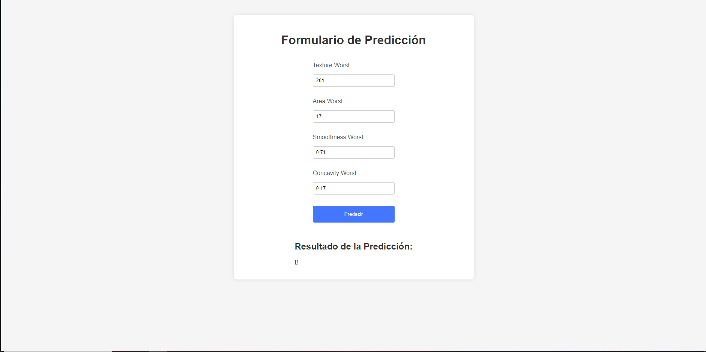

# Api-BreastCancerModel
Repository for a Python model I have trained with a breast cancer dataset, in order to use it in a frontend.

To run this project simply clone it 
```
    git clone https://github.com/SergioManuelJob/Api-BreastCancerModel.git
```

To run the server run your Python terminal and in the API folder just type:
```
    python ./server.py
```

Once the server is running, you can access the API using the port 5000 and obviously localhost. For an example of how the request looks, here's the Postman documentation:
https://documenter.getpostman.com/view/23431388/2s9YymH5WP

And for the frontend part, use your terminal to put yourself in the frontend folder, run

```
    npm i
```

To install all of the requirements of React, and then once is done run it with

```
    npm start
```

And with that, you should have the API running so you can predict with the interface. Enjoy!




